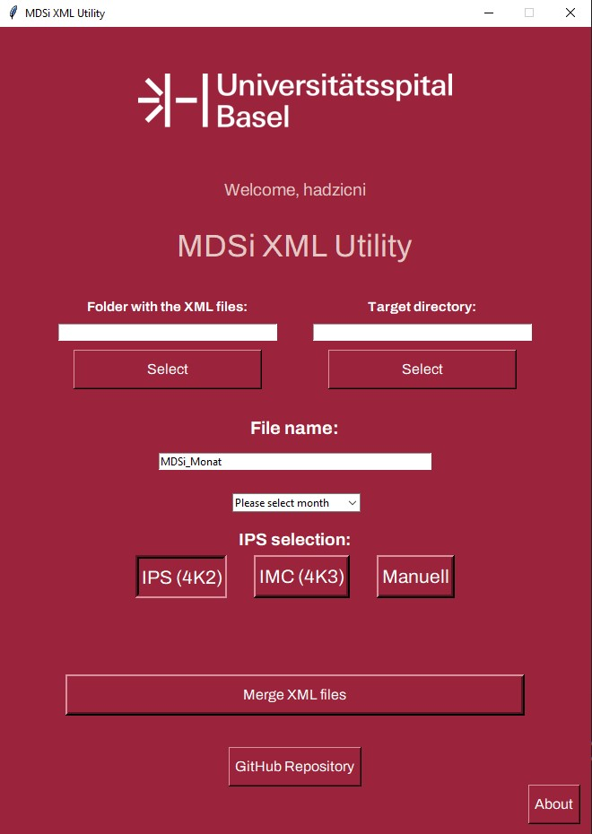

<p align="center">

</p>
<p align="center">

</p>

# MDSi XML Utility

## Overview
The MDSi XML Utility is a Python program that allows you to merge multiple XML files into a single XML file. It is particularly useful for combining XML data into a specified format with customizable options. This utility comes with a user-friendly graphical user interface (GUI) built using the Tkinter library, making it easy to use.

## Features
•	Merge multiple XML files into a single XML file.
•	Customize the output format with options for IPS choice.
•	Automatic filename generation based on IPS choice.
•	Easily select source and target directories for merging.
•	User-friendly GUI for ease of use.


## Usage
1.	Select the folder containing the XML files you want to merge by clicking the "Auswählen" button next to "Ordner mit den XML-Dateien."
2.	Choose the output folder by clicking the "Auswählen" button next to "Zielverzeichnis."
3.	Specify your IPS choice by selecting one of the radio buttons under "IPS-Auswahl." You can choose from "IPS 4K2," "IMC 4K3," or "Manuell."
4.	If you want to use the default filename based on your IPS choice, you can leave the "Dateiname" field as is. Alternatively, you can manually enter your desired filename.
5.	Click the "XML-Dateien zusammenführen" button to start the merging process.
6.	A confirmation message will be displayed, and the merged XML file will be saved in the selected output folder.
7.	If you are using Windows, the output folder will open in File Explorer automatically.
5. Run the program by executing the following command:

   ```bash
   python main.py

## About
This tool was created by Nikola Hadzic. The current version is 3.8.
For any questions or issues, please contact the author at nikola.hadzic@usb.ch.

## System Requirements
•	Python 3.x

•	Tkinter (usually included with Python installations)

•	PIL (Python Imaging Library)

•	An operating system with the ability to open the file explorer (for automatic folder opening)

# License
This software is released under the MIT License.

### Note: This README is intended to provide an overview of the program and its usage. For detailed technical information, please refer to the source code.
