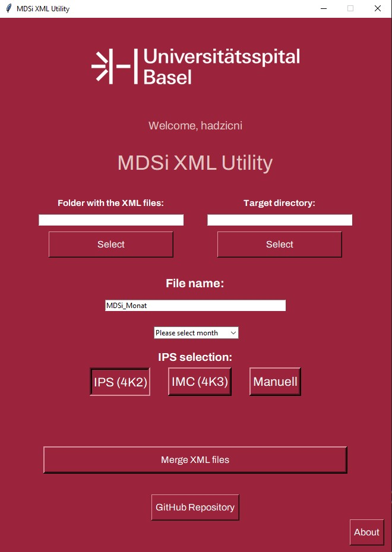

# MDSi XML Utility - UHBS

<p align="left">

</p>
<p align="center">

</p>

## About
The MDSi XML Utility is a specialized tool developed for the University Hospital Basel (UHBS) to streamline the process of merging multiple XML files. This application features a user-friendly graphical interface and supports various IPS configurations, making it an essential tool for managing medical data systems integration.

## Key Features
- **XML File Merging**: Combine multiple XML files into a single structured file
- **IPS Configuration Support**: 
  - IPS 4K2
  - IMC 4K3
  - Manual configuration
- **Smart Filename Generation**: Automatic naming based on IPS choice
- **User-Friendly Interface**: Modern GUI with intuitive controls
- **Directory Management**: Easy selection of source and target directories
- **Preview Functionality**: View merged data before saving

## Installation

### For Users
1. Download the latest release from the [releases page](https://github.com/hadzicni/MDSi-Utility-UHBS/releases)
2. Extract the ZIP file to your desired location
3. Run `MDSi-XML-Utility.exe`
4. Follow the in-app instructions to merge XML files

### For Developers
```bash
# Clone repository
git clone https://github.com/hadzicni/MDSi-Utility-UHBS.git
cd MDSi-Utility-UHBS

# Create and activate virtual environment
python -m venv .venv
.venv\Scripts\activate

# Install dependencies
pip install -r requirements.txt

# Run application
python main.py
```

## Usage Guide

### Basic Operation
1. Launch the application
2. Select source folder containing XML files
3. Choose output directory
4. Select IPS configuration
5. (Optional) Customize output filename
6. Click "XML-Dateien zusammenführen" to merge files

### IPS Configurations
- **IPS 4K2**: Standard configuration for general use
- **IMC 4K3**: Enhanced configuration for specialized cases
- **Manual**: Custom configuration options

### Output Format
The merged XML file follows this structure:
```xml
<?xml version="1.0" encoding="utf-8"?>
<MDSi>
    <Header>
        <IPSID>4K2</IPSID>
        <!-- Additional headers -->
    </Header>
    <!-- Merged content -->
</MDSi>
```

## Development

### Project Structure
```
MDSi-Utility-UHBS/
├── main.py          # Main application logic
├── requirements.txt # Project dependencies
├── README.md       # Project documentation
└── assets/         # Images and resources
```

### Building from Source
```bash
pip install pyinstaller
pyinstaller mdsi_utility.spec
```

### Contributing
Please read [CONTRIBUTING.md](CONTRIBUTING.md) for details on our code of conduct and the process for submitting pull requests.

## Documentation
- [Changelog](CHANGELOG.md)
- [Contributing Guide](CONTRIBUTING.md)

## Support and Contact
For technical support or bug reports:
- **Developer**: Nikola Hadzic
- **Email**: nikola.hadzic@usb.ch
- **Issue Tracker**: [GitHub Issues](https://github.com/hadzicni/MDSi-Utility-UHBS/issues)

## License
This project is proprietary software developed for UHBS. All rights reserved.

## Acknowledgments
- University Hospital Basel (UHBS) IT Department
- Medical Data Systems Integration Team
- All contributors and testers

---
 2025 University Hospital Basel (UHBS). Version 3.8
